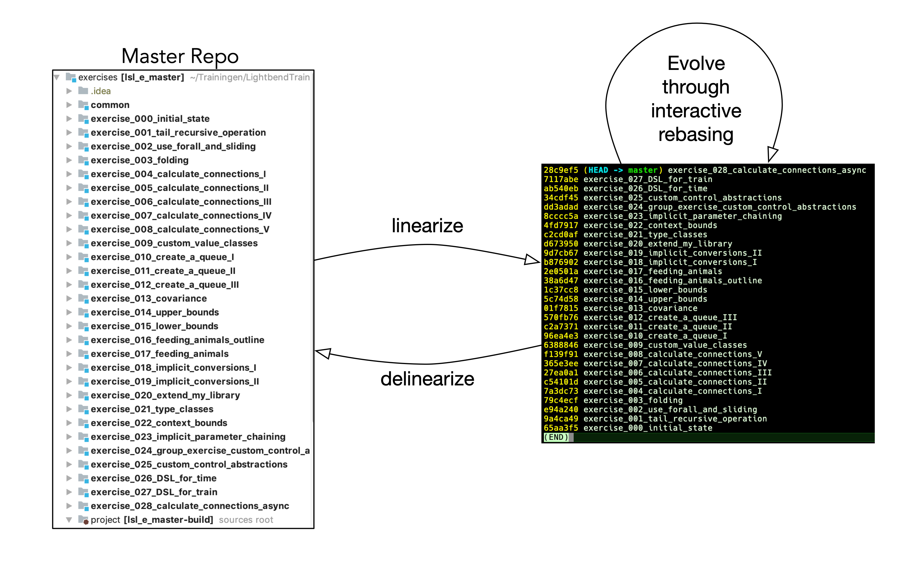

# Moving Forward from Scala 2 to Scala 3

## Description

The target audience for this course is the Scala _Application_ Developer Community. In other words, the focus is on people who use the language to develop 'end-user' applications and not necessarily those developers who design and write libraries, toolkits or frameworks (although they may benefit from what is in this course if they haven't already worked with Dotty).

The goal of the course is to explore the new features in the Scala language brought by [the Dotty project](https://dotty.epfl.ch). Even though it is still early days and the first release candidate of the Scala 3 language is probably not out for another 6 months, it is our believe that one can never start too early to learn Dotty for the following reasons:

- There is a lot to learn, so if you wait until everything is ready, you risk having to play catchup.
- There are many opportunities to contribute to the Dotty project, which will accelerate its development in the coming months. Using Dotty will provide opportunities to identity issues to be fixed sooner rather than later.

## Approach

We start from an existing Scala 2 application: an [[Akka](https://akka.io)] actor based Sudoku solver. We start from the application as-is, but with an sbt build definition that uses the Dotty compiler.

Through a series of exercises, we look at specific Dotty features and apply these to the Scala 2 code, thereby transforming it step-by-step into a version that exploits a whole series of nice features offered by the new language.

Note that this is work in progress, so keep watching this space!

## Usage

This repository is structured in such a way that it can be transformed to two different artefacts for specific use cases:

- A _studentified_ repository: this is a standalone sbt project which is typically used for teaching or learning purposes. A user of the this repo will be working on one exercises at any one point in time and will be able to use a number of custom [sbt] commands that allow the following:
    - `man`: print a manual page for the global project
    - `man e`: print a manual page for the current exercise. In general, this page will contain some background and a series of exercises instructions, hints or tips for the current exercise
    - `listExercises`: will print a list of all available exercises
    - `nextExercise`: move to the next exercise and pull in the tests (if any) for that exercise. This command preserves the current state of the application [as modified by the user].
    - `prevExercise`: the opposite of the `nextExercise` command
    - `pullSolution`: pulls in the complete code for the current exercise. This command is handy in a class room setting where at some point in time, the instructor wants to move to the next exercise and the student hasn't completed the current exercise. Note that it will overwrite any code written by the student
    - `saveState`: can be executed prior to executing the `pullSolution` command: it will save the current state of an exercise so that it can be restored later.
    - `savedStated`: show the exercise ids of all exercises for which the sate was saved
    - `restoreState <exerciseID>`: restore a previously save state
- A _linearized_ repository: this is a git repository in which every exercise in the master repository is turned into a commit. In general this is a scratch pad repository that is discarded once it has served its purpose. In this use case, interactive rebasing on the linearized repo is used to transform the code across a range of exercises. Once this rebasing is finished, all applied changes can be applied on the master repo by a process of `deliniarization`. There is a second use case for a linearized repo: it can can be used to inspect the differences between consecutive exercises (using a tools such as `SourceTree` or `GitKraken`.

_Studentification_, _linearization_, and _delinearization` as well as some administrative tasks (such as renumbering exercises), is done using the so-called [Course Management Tools](https://github.com/lightbend/course-management-tools).

### How to _"studentify"_ a master repository

1. Choose a folder in which the _studentified_ version will be 
- Clone the [Course Management Tools (CMT)](https://github.com/lightbend/course-management-tools)
- Start an `sbt` session in the cloned CMT repo
- Run the _studentify_ command and provide two arguments:
    - The first one is the _absolute_ path to the root folder of the master repository of the exercises
    - The second one is the absolute path of the folder in which the studentified version will be created
- Once the _studentify_ command is finished, you can _cd_ into the studentified versions root folder and start an _sbt_ session. You will now be able to use all the student commands listed in the previous section.

### How to _"linearize"_/_"delinearize"_ a master repository

The following picture shows the typical process to evolve code in a master repository with the utilisation of a _linearized_ repository:

Follow the following steps:

1. Choose a folder in which the _linearized_ version will be 
- Clone the [Course Management Tools (CMT)](https://github.com/lightbend/course-management-tools)
- Start an `sbt` session in the cloned CMT repo
- Run the _linearize_ command and provide two arguments:
    - The first one is the _absolute_ path to the root folder of the master repository of the exercises
    - The second one is the absolute path of the folder in which the _linearized_ version will be created
- Once the _linearize_ command is finished, _cd_ into the _linearized_ versions root folder and start refactoring your code using interactive rebasing (e.g. `git rebase -i --root`).
- To apply all changes made in the _linearized_ repo to the master repository, execute the `delinearize` command supplying two arguments:
  - The first one is the _absolute_ path to the root folder of the master repository of the exercises
  - The second one is the absolute path of the `linearized` project folder
- Repeat the interactive rebasing / _delinearization_ sequence as many times as you want

> NOTES
> 
> - During the process of interactive rebasing, make sure NOT to change the commit message (which in fact is the exercises project name) or to squash commits as this will make it impossible to _delinearize_ the project.
> - Editing code in the master repo and editing code via _linearize_/_delinearize_ are mutually exclusive processes. In practice, this means that when you've been using `linearize`/`delinearize` and you decided to make a change directly to files in the exercises in the master repository, you should discard the `linearized` artifact.
> - Project `common` is aggregated in all exercises. As such, it is the same across _all_ exercises. Also, the _Linearization_/_Delinearization_ process will not transfer changes made in the _linearized_ repository
> `studentify` and `linearize` mandate that your master repository has no files in your git _index_ or _workspace_, so commit any work before using these commands. Don't worry about commiting stuff temporarily. Either stash any pending changes or commit them and possibly squash them later.
> Finally: reflect carefully about the best editing approach. In many cases, direct edits in the master repository maybe simpler to apply than going through an interactive rebasing session.
