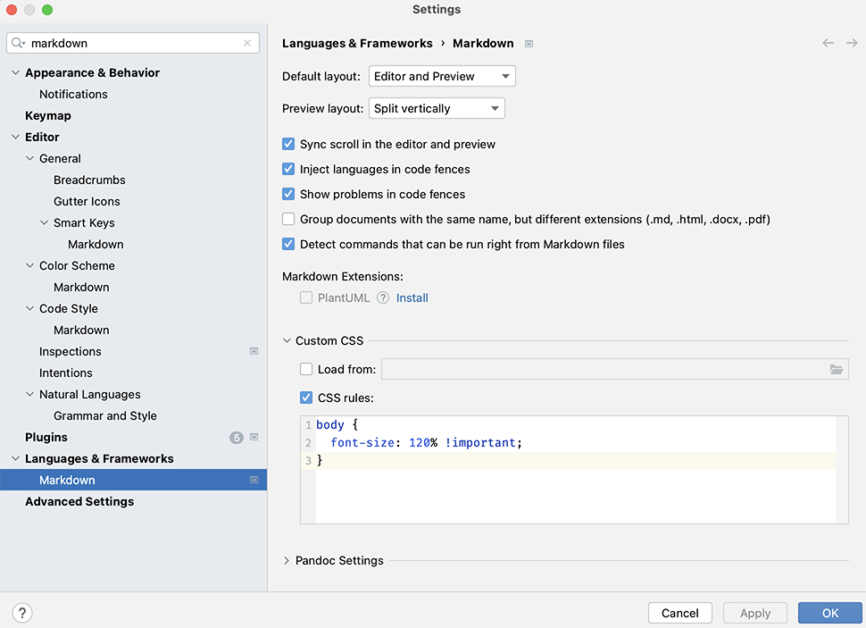

# Initial State

## Documentation

You may want to have look at the [Scala Language website](https://www3.scala-lang.org)
and bookmark it in your favourite browser.

It has a number of links among which:

- The [Scala 3 Language Reference](https://docs3.scala-lang.org/scala3/reference).
- The [Scala API documentation](https://docs3.scala-lang.org/api/all.html) for every version of Scala.
- The [Scala 3 Book](https://docs3.scala-lang.org/scala3/book/introduction.html) which
  gives you a concise introduction to all things Scala 3.

## An Akka Typed/Scala based Sudoku Solver

## Background

This application, written in Scala 2, implements an Akka Typed/Scala
based Sudoku Solver that is composed of 29 actors.

The application will also start up an instance of a Sudoku problem generator
that continuously cycles through a series of Sudoku problems at a configurable
rate, tunable via configuration.

The course consists of a series of exercises in which you change the source code to leverage Scala 3 specific features. The application comes with tests that are basically the same across all exercises. The tests should pass at every stage: if they don't, you've broken something and you will need to fix it.

We will first show you how to test and run the application.


## Steps

- The project uses sbt as build tool. Have a look at the build definition
  in the `code/build.sbt` file to figure out what version of Scala it is
  using. The full build definition is composed of `code/build.sbt` and
  `code/project/Build.scala`. Other than inspecting the build definition,
  is there another way to find out which Scala version is used?

- In the project's `code` folder, start an `sbt` session.

- Compile the main code and the test code by respectively running the
  `compile` and `Test/compile` commands from the `sbt` prompt.
  Look for compilation warnings and fix these so that compilation no longer
  produces any warning(s).

- Run the provided tests by executing the `test` command from the `sbt` prompt
  You should see output similar to the following:
  
```scala
man [e] > Scala 2 to Scala 3 > sudoku solver initial state > test
[info] Compiling 11 Scala sources to /Users/ericloots/tmp/lin/lunatech-scala-2-to-scala3-course/exercises/target/scala-0.24/classes ...
[info] Compiling 6 Scala sources to /Users/ericloots/tmp/lin/lunatech-scala-2-to-scala3-course/exercises/target/scala-0.24/test-classes ...
SLF4J: A number (1) of logging calls during the initialization phase have been intercepted and are
SLF4J: now being replayed. These are subject to the filtering rules of the underlying logging system.
SLF4J: See also http://www.slf4j.org/codes.html#replay
[info] SudokuDetailProcessorSpec:
[info] Sending no updates to a sudoku detail processor
[info] - should result in sending a SudokuDetailUnchanged messsage
[info] Sending an update to a fresh instance of the SudokuDetailProcessor that sets one cell to a single value
[info] - should result in sending an update that reflects this update
[info] Sending a series of subsequent Updates to a SudokuDetailProcessor
[info] - should result in sending updates and ultimately return no changes
[info] ReductionRuleSpec:
[info] Applying reduction rules
[info] - should Eliminate values in isolated complete sets from occurrences in other cells (First reduction rule)
[info] - should Eliminate values in isolated complete sets of 5 values from occurrences in other cells (First reduction rule)
[info] - should Eliminate values in 2 isolated complete sets of 3 values from occurrences in other cells (First reduction rule)
[info] - should Eliminate values in shadowed complete sets from occurrences in same cells (Second reduction rule)
[info] - should Eliminate values in shadowed complete (6 value) sets from occurrences in same cells (Second reduction rule)
[info] CellMappingSpec:
[info] Mapping row coordinates
[info] - should result in correct column & block coordinates
[info] Mapping column coordinates
[info] - should result in correct row & block coordinates
[info] Mapping block coordinates
[info] - should result in correct row & column coordinates
[info] Run completed in 562 milliseconds.
[info] Total number of tests run: 11
[info] Suites: completed 3, aborted 0
[info] Tests: succeeded 11, failed 0, canceled 0, ignored 0, pending 0
[info] All tests passed.
[success] Total time: 9 s, completed 04 Jun 2020, 12:47:16
man [e] > Scala 2 to Scala 3 > sudoku solver initial state >
```

- Run the Sudokusolver by executing the `runSolver` command from the `sbt` prompt.

- Note that you can stop the application by hitting `Return` in the sbt session.

- Observe sudoku solver in action: you should see the following output:

```scala
man [e] > Scala 2 to Scala 3 > sudoku solver initial state > runSolver
[info] running org.lunatechlabs.dotty.SudokuSolverMain -Dcluster-node-configuration.cluster-id=cluster-0 -Dcluster-node-configuration.node-hostname=localhost -Dakka.remote.artery.canonical.port=2550
08:55:17 INFO  [] - Slf4jLogger started
SLF4J: A number (1) of logging calls during the initialization phase have been intercepted and are
SLF4J: now being replayed. These are subject to the filtering rules of the underlying logging system.
SLF4J: See also http://www.slf4j.org/codes.html#replay
Hit RETURN to stop solver
08:55:18 INFO  [akka://sudoku-solver-system/user/sudoku-solver] - Sudoku processing time: 156 milliseconds
08:55:18 INFO  [akka://sudoku-solver-system/user/sudoku-problem-sender] -
+---+---+---+
|712|948|635|
|835|762|941|
|496|531|278|
+---+---+---+
|147|896|352|
|569|213|784|
|283|475|169|
+---+---+---+
|324|659|817|
|951|387|426|
|678|124|593|
+---+---+---+
08:55:18 INFO  [akka://sudoku-solver-system/user/sudoku-solver] - Sudoku processing time: 44 milliseconds
08:55:18 INFO  [akka://sudoku-solver-system/user/sudoku-problem-sender] -
+---+---+---+
|678|124|593|
|951|387|426|
|324|659|817|
+---+---+---+
|283|475|169|
|569|213|784|
|147|896|352|
+---+---+---+
|496|531|278|
|835|762|941|
|712|948|635|
+---+---+---+
.
.
.
```

- You can control the rate at which the Sudoku problem generator sends
  problems by tweaking the setting `sudoku-solver.problem-sender.send-interval`
  in the `sudokusolver.conf` configuration file.

## Source code formatting & Markdown viewer in IntelliJ


### Source code formatting

[scalafmt](https://github.com/scalameta/scalafmt) based source code formatting is
in place in this project. scalafmt supports both Scala 2 and Scala 3. You can
[re]format the code by running `scalafmtAll` from the sbt prompt. As we switch from
Scala 2 to Scala 3, you need to make sure that a matching scalafmt configuration is
in place. In any of the exercises, you can run `cmtc pull-template .scalafmt.conf`
to "pull-in" the correct configuration file.

### Markdown viewer in IntelliJ IDEA

The font size can be a bit too small for the taste of some people. You can change the
Markdown zoom setting in IntelliJ by pasting the following CSS snippet in the
markdown setting in _" Settings" -> "Languages & Frameworks" -> "Custom CSS -> CSS rules"_ and adjust the font-size setting to your liking:

```
body {
  font-size: 120% !important;
}
```


