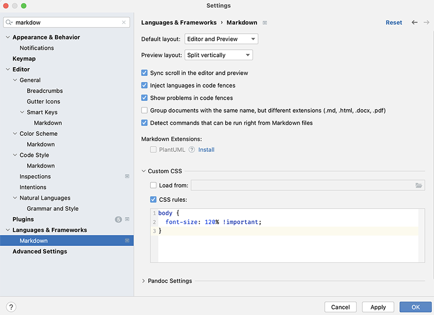

# Scala 3 - new control and indentation based syntax


## Background

Scala 3 introduces some new syntax which can be divided in two categories:

- A new control structure syntax
- The possibility to use a significant indentation based syntax as opposed
  to the traditional syntax using curly braces

The Scala 3 compiler is able to rewrite existing source code to a different syntax.
Note that this rewriting is done one step at a time. In other words, rewriting to 
the new significant indentation based syntax _and_ to the new control structure syntax
cannot be done in a single step.

Changing the syntax is a reversible process (except that after going back to where
one came from, the formatting may be different, but semantically equivalent).

## Steps

- Have a look at the `project/Build.scala` file and notice this section at the top:

```scala
  val rewriteNewSyntax = Seq("-rewrite", "-new-syntax")
  val rewriteIndent = Seq("-rewrite", "-indent")
  val rewriteNoIndent = Seq("-rewrite", "-noindent")
  val rewriteOldSyntax = Seq("-rewrite", "-old-syntax")
```

- If you didn't take a snapshot by committing the code changes at the end of the
  previous exercise, do so now by executing the following command:

```scala
$ git commit -a -m "Snapshot before Scala 3 compiler syntax rewrites"
```

You can now have the compiler rewrite the source code to switch to one of the
alternative syntax options.

- The values mentioned above each contain a specific set of compiler options
  for a specific syntax rewrite.
- Note that syntax rewrites have to be executed one at a time. Also, consecutive
  syntax rewrites have to be executed in a certain order. Make sure you understand
  what's explained in the section named `Settings and Rewrites` at the end of the
  [Optional Braces](https://dotty.epfl.ch/docs/reference/other-new-features/indentation.html)
  section in the Scala 3 reference documentation.

- Now go through the following sequence of actions:
  - Add one of the syntax rewrite values to the compiler option section.

Question: you will need to concatenate the `Seq` of settings with the compiler
option setting. How would you do that. If needed, consult the `Seq` Scala collection
documentation.

  - When the changes are applied, these will be picked up automatically by sbt because
    the build has been configured as such.
  - From the sbt prompt, run the `clean` command followed by running `compile`.
    You will see that the compiler will _patch_ the source files.
  - Repeat this by compiling the test code (`Test / compile`).
  - Explore the changes applied by the rewrites (you can use the `git diff` command
    for this).
  - Repeat the process for the next rewrite, so that you end up with code using the
    New Control Structures syntax and the Fewer Braces syntax.

> For the remainder of the exercises in this course, we will use the New Control
> Structure syntax and the Fewer Braces syntax.

- Checkpoint the current state of the code by executing the following command:

```scala
$ git commit -a -m "Snapshot after Scala 3 compiler syntax rewrites"
```

### Next steps

After successfully completing the tasks in this exercise, move to the next one by
running the `cmtc next-exercise` from the command line.

## Source code formatting & Markdown viewer in IntelliJ

### Source code formatting

[scalafmt](https://github.com/scalameta/scalafmt) based source code formatting is
in place in this project. scalafmt supports both Scala 2 and Scala 3. You can
[re]format the code by running `scalafmtAll` from the sbt prompt. As we switch from
Scala 2 to Scala 3, you need to make sure that a matching scalafmt configuration is
in place. In any of the exercises, you can run `cmtc pull-template .scalafmt.conf`
to "pull-in" the correct configuration file.

### Markdown viewer in IntelliJ

The font size can be a bit too small for the taste of some people. You can change the
Markdown zoom setting in IntelliJ by pasting the following CSS snippet in the
markdown setting in _" Settings" -> "Languages & Frameworks" -> "Custom CSS -> CSS rules"_
and adjust the font-size setting to your liking:

```
body {
  font-size: 120% !important;
  }
```


