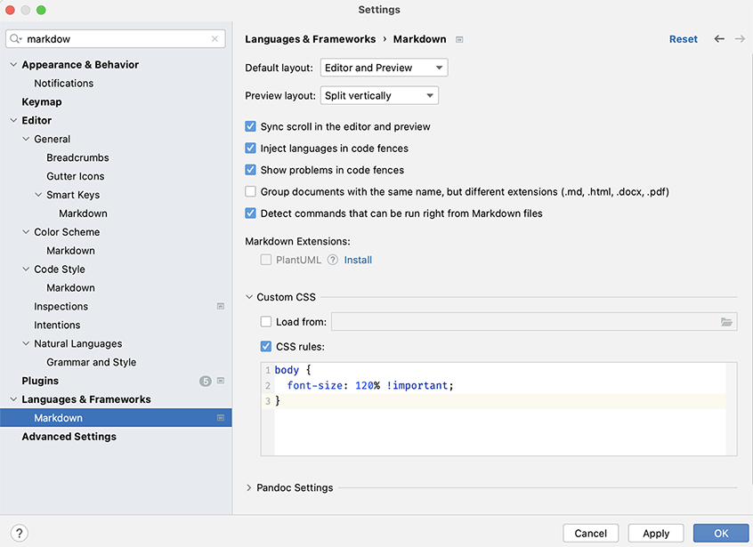

# Union Types

## Background

In the previous exercise, we re-encoded the protocol of the different actors
in our application from a `sealed trait` based one to one using Scala 3
enumerations. This however, is only a small first step towards a major
simplification of the way encode the exchange of messages between actors.
We will now explore using Scala 3's `Union Types` to vastly simplify the Scala 2
based implementation. We will succeed in eliminating the so-called message
adapters and response wrappers from our code!

The general idea is that we have both an external protocol for an actor (which
is exactly the same as in the original implementation) and an [extended] 
internal protocol that also 'understands' the responses the actor can receive.

## Steps

Have close look at the 4 different actors in the application:

  - `SudokuProblemSender`
  - `SudokuSolver`
  - `SudokuProgressTracker`
  - `SudokuDetailProcessor`

Which of these actors receive messages that are responses from other actors?


`Hint:` In its present form, the application utilises message adapters. You
      can easily spot these by doing a search on the factory method to
      create them: `context.messageAdapter`.

`Tip:`  Tackle the `SudokuProblemSender` first. After this, proceed with
      the other actors.

- Create a type alias named `CommandAndResponses` for the Union of the
  actor's external protocol (`Command`) and the `Response` message types.
  This new type will be the type of the internal protocol.

- Adapt the `apply` method that creates the actor's behaviour so that it
  still is the original behaviour as seen from the outside, but which
  has the extended behaviour (corresponding to `CommandAndResponses`).
  You will need to make a few extra modifications to make everything
  type check. Some hints that may put you on the right track:

  - Note that `Behaviors.setup` has a type parameter
  - `Behaviors.setup` returns a `Behavior` of some type. Look at the
    API docs of `Behavior` and specifically at the `narrow` method.
    You will need to apply this method in your code
  - A typical pattern in Akka Typed code is the inclusion of a so-called
    `ActorRef` conventionally called `replyTo`. In the existing code,
    this is the message adaptor. With the latter being eliminated from
    the code, you need to substitute it with another `ActorRef`. Which
    one makes sense? In this context, have a look at the available
    members on an actor's `context`

- Eliminate any unused code such as:
  - The message adapters
  - The `Response` message wrappers

- Run the provided tests by executing the `test` command from the `sbt` prompt
  and verify that all tests pass

- Let's take a step back to see what we achieved:
  - We have removed a lot boilerplate code which improves code reablility
    tremendously.
  - We have solved the issue of widening some of the actor's protocol
    in the previous exercise for pure technical reasons.

- Verify that the application runs correctly

### Next steps

After successfully completing the tasks in this exercise, move to the next one by
running the `cmtc next-exercise` from the command line.

## Source code formatting & Markdown viewer in IntelliJ

### Source code formatting

[scalafmt](https://github.com/scalameta/scalafmt) based source code formatting is
in place in this project. scalafmt supports both Scala 2 and Scala 3. You can
[re]format the code by running `scalafmtAll` from the sbt prompt. As we switch from
Scala 2 to Scala 3, you need to make sure that a matching scalafmt configuration is
in place. In any of the exercises, you can run `cmtc pull-template .scalafmt.conf`
to "pull-in" the correct configuration file.

### Markdown viewer in IntelliJ

The font size can be a bit too small for the taste of some people. You can change the
Markdown zoom setting in IntelliJ by pasting the following CSS snippet in the
markdown setting in _" Settings" -> "Languages & Frameworks" -> "Custom CSS -> CSS rules"_
and adjust the font-size setting to your liking:

```
body {
  font-size: 120% !important;
  }
```


