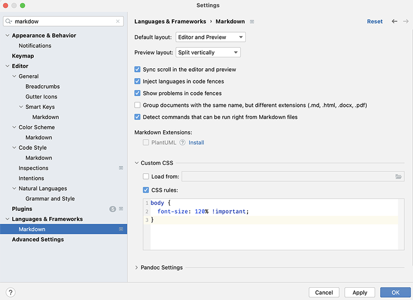

# Scala 3 - new indentation based syntax


## Background

Scala 3 introduces a new indentation based syntax which is quite similar to what
other languages such as Python have:

The Scala 3 compiler is able to rewrite existing source code to a different syntax.
Note that this rewriting is done one step at a time. In other words, rewriting to 
the new significant indentation based syntax -and- to the new control structure syntax
cannot be done in a single step.

Changing the syntax is a reversible process (except that after going back to where
one came from, the formatting may be different, but semantically equivalent).

In this exercise, we will use the compiler to switch to the new indentation based
syntax.

## Steps

- Have a look at the `project/Build.scala` file and notice this section at the top:

```scala
  val rewriteNewSyntax = Seq("-rewrite", "-new-syntax")
  val rewriteIndent = Seq("-rewrite", "-indent")
  val rewriteNoIndent = Seq("-rewrite", "-noindent")
  val rewriteOldSyntax = Seq("-rewrite", "-old-syntax")
```

- Before proceeding, let's take a snapshot of the current state of the exercises
  by executing the following commands:

```scala
$ git add -A
$ git commit -m "Snapshot before rewrite to Scala 3's significant indentation based syntax"
```

You can now have the compiler rewrite the source code to switch to one of the
alternative syntax options.

- The values mentioned above each contain a specific set of compiler options
  for a specific syntax rewrite.

- Now add the `rewriteIndent ` settings to the compiler options.

  - When the changes are applied, these will be picked up automatically by sbt because
    the build has been configured as such.
  - From the sbt prompt, run the `clean` command followed by running `compile`.
    You will see that the compiler will _patch_ the source files.
  - Repeat this by compiling the test code (`Test / compile`).
  - Explore the changes applied by the rewrites (you can use the `git diff` command
    for this).

## Source code formatting & Markdown viewer in IntelliJ

### Source code formatting

[scalafmt](https://github.com/scalameta/scalafmt) based source code formatting is
in place in this project. scalafmt supports both Scala 2 and Scala 3. You can
[re]format the code by running `scalafmtAll` from the sbt prompt. As we switch from
Scala 2 to Scala 3, you need to make sure that a matching scalafmt configuration is
in place. In any of the exercises, you can run `cmtc pull-template .scalafmt.conf`
to "pull-in" the correct configuration file.

### Markdown viewer in IntelliJ

The font size can be a bit too small for the taste of some people. You can change the
Markdown zoom setting in IntelliJ by pasting the following CSS snippet in the
markdown setting in _" Settings" -> "Languages & Frameworks" -> "Custom CSS -> CSS rules"_
and adjust the font-size setting to your liking:

```
body {
  font-size: 120% !important;
  }
```


