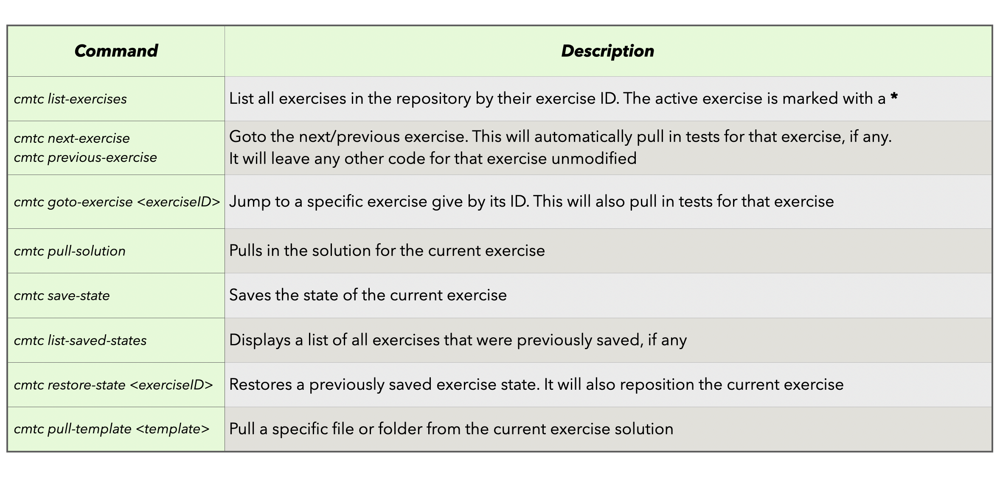

<!-- .slide: data-background-color="#781010" data-background-image="images/bg-reveal.ps.png" -->

[//]: # (The following is a hack to move the slide H2 section down)
## &#173;
## &#173;
## &#173;
## Introduction

---

## Course overview
## &#173;

* In this course we will:
    * Start from an existing Scala (2.13)/[Akka Typed](https://doc.akka.io/docs/akka/current/typed/actors.html#module-info) (2.6) based application
    * Apply features introduced in the Scala language as part of the Scala 3 project
### &#173;
* The objective is to illustrate how these new features:
    * Bring added value and can simplify Scala code
    * Remove some of the inconsistencies or warts from the Scala 2 language

---

## Course prerequisites
## &#173;

* The participants should have practical experience with the Scala 2 language
* The course has a number of exercises and each student should have a computer with the following installed:
    * JDK 11 (e.g. [AdoptOpenJDK 11](adoptopenjdk.net))
    * [sbt](https://www.scala-sbt.org/1.x/docs/Setup.html)
    * An editor or IDE of your choice configured to work with Scala 3 code
        * Possible options are:
            * [Metals](scalameta.org) with your client of choice ([Visual Code Studio](https://scalameta.org/metals/docs/editors/vscode.html), [Vim](https://scalameta.org/metals/docs/editors/vim.html), etc…)
            * [IntelliJ IDE](https://www.jetbrains.com/idea/) with the Scala plugin installed and [configured to use the nightly build](https://blog.jetbrains.com/scala/2020/03/17/scala-3-support-in-intellij-scala-plugin/)
* Optionally install the Scala 3 compiler and Scala 3 REPL
    * This can be done using Coursier:
        * *`cs install scalac:3.3.0`*
        * *`cs install scala:3.3.0`*

---

## Preparing for the exercises
## &#173;

* Download the student-ready version of the exercises [here](https://github.com/lunatech-labs/lunatech-scala-2-to-scala3-course/releases)
* Unzip the downloaded artefact and *`cd`* into the *`lunatech-scala-2-to-scala3-course`* folder
    * This folder contains an *`sbt`* project that contains all the exercises
* Start an *`sbt`* session in the root folder
* Load the project into your favourite development environment (IDE)

---

## Student exercise repository functionality
## &#173;

- We use the *`cmtc`* command from the command line to navigate the course.

---

## Agenda - I
## &#173;

* Course Overview
* Scala 3 Migration course
  * Setting up the Scala 3 Migration Tool
  * Migrating:
    * Scala dependencies
    * Scala compiler options
    * Scala syntax
    * Types
* Moving from Scala 2 to Scala 3 workshop/course
  * A recap on:
      * Scala 2
      * The Scala 3 project
      * The Akka Toolkit
  * A [detailed] look at the Scala 2/Akka Typed based Sudoku Solver

---

## Agenda - II
## &#173;

* Scala 3 features & exercises:
* **scala3-compiler** code rewrite capabilities
    * [Top Level Definitions](https://dotty.epfl.ch/docs/reference/dropped-features/package-objects.html)
    * [Parameter Untupling](https://dotty.epfl.ch/docs/reference/other-new-features/parameter-untupling.html)
    * [Extension methods](https://dotty.epfl.ch/docs/reference/contextual/extension-methods.html)
    * [Contextual Abstractions](https://dotty.epfl.ch/docs/reference/contextual/index.html) ([given instances](https://dotty.epfl.ch/docs/reference/contextual/givens.html), [using clauses](https://dotty.epfl.ch/docs/reference/contextual/using-clauses.html), [summoning instances](https://dotty.epfl.ch/docs/reference/contextual/using-clauses.html))
    * [Enumerations](https://dotty.epfl.ch/docs/reference/enums/enums.html) and [export clauses](https://dotty.epfl.ch/docs/reference/other-new-features/export.html)
    * [Intersection Types](https://dotty.epfl.ch/docs/reference/new-types/intersection-types.html) and [Union Types](https://dotty.epfl.ch/docs/reference/new-types/union-types.html)
    * [Opaque Type Aliases](https://dotty.epfl.ch/docs/reference/other-new-features/opaques.html)
    * [Multiversal Equality](https://dotty.epfl.ch/docs/reference/contextual/multiversal-equality.html)
* Wrap-up & Conclusions

---

## The teachers
## &#173;

* _Eric Loots_ (Lunatech Belgium)
* _Adrien Piquerez_ (EPFL Scala Center Switzerland)
* _Trevor Burton-McCreadie_ (Lunatech United Kingdom)

---

## You!
## &#173;

* Briefly introduce yourself (Name? Where do you live/work? Passions, ...)
* What is your connection with Scala [3]?
* Please share your experience with Scala and your migration experiences, if any.
* What would you like to learn in the coming two days?
