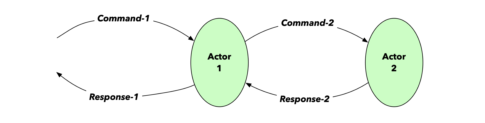

<!-- .slide: data-background-color="#781010" data-background-image="images/bg-reveal.ps.png" -->

[//]: # (The following is a hack to move the slide H2 section down)
## &#173;
## &#173;
## &#173;
## &#173;
## Recap
### Scala 2, Dotty, Scala 3, and Akka Typed

---

## Scala 2 - The current state
## &#173;

* Currently supported versions
    * 2.12
    * 2.13
        * Important progress on compiler performance and collections rewrite
        * New, binary compatible *`Vector`* implementation
        * Most recent release 2.13.10
        * Allow, under some restrictions to use Scala 3 libraries in Scala 2 code (using Tasty) and vice-versa. See the [Compatibility Reference pages](https://docs.scala-lang.org/scala3/guides/migration/compatibility-intro.html) in the Scala 3 Migration Guide

---

## Dotty/Scala 3
## &#173;

* Dotty 0.21.0-RC1: feature complete for Scala 3 (December 2019)
* 3.0.0 released on May 13, 2021
* Current release 3.2.2 released on February 1st, 2023 
* Tooling - Status
    * Metals:
        * integrated support in Metals including Scala Worksheet support!
    * IntelliJ
        * Scala 3 support in Scala Plugin
* There's the [Scala 3 Migration Guide](https://docs.scala-lang.org/scala3/guides/migration/compatibility-intro.html)!

---

## The Actor Model and Akka
## &#173;

* As mentioned before, the Scala 2 application we'll be working with, uses the Akka toolkit and is composed of a number of so-called Actors
* Akka Actors are based on the [Actor Model](https://en.wikipedia.org/wiki/Actor_model) invented by [Carl Hewitt ](https://en.wikipedia.org/wiki/Actor_model)in 1973
* The Actor Model provides:
    * A higher level of abstraction for writing *concurrent and distributed* applications
    * Alleviates the developer from having to deal with explicit locking and thread management
* An Actor is the base unit of computing in the Actor Model
* An Actor
    * Has an address (of type ***ActorRef***)
    * Can send messages to other Actors
    * Can create other Actors
    * Has a behaviour that can potentially change after processing a message

---

## Akka Actors - Protocol Definition
## &#173;

* An Actor has a Protocol that defines
    * The message [types] it can process: so-called ***Commands***
    * The messages it can send in response: so-called ***Responses***

