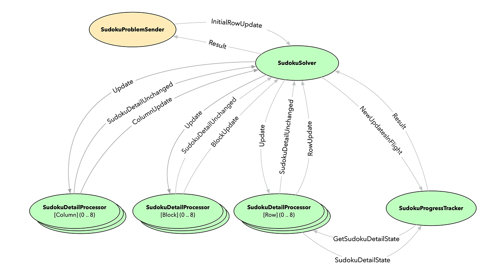

<!-- .slide: data-background-color="#781010" data-background-image="images/bg-reveal.ps.png" -->

[//]: # (The following is a hack to move the slide H2 section down)
## &#173;
## &#173;
## &#173;
## &#173;
## THE SCALA 2/AKKA TYPED BASED SUDOKU SOLVER

---

## The Reference Scala 2 Application
## &#173;

- A Scala 2/Akka Typed based Sudoku Solver
- Actor based - mimics how one manually solves a Sudoku

---

## The Reference Scala 2 Application
### The Cast (composed of 30 actors)

---

## The Reference Scala 2 Application
## &#173;

- Let's have a look at the code!
