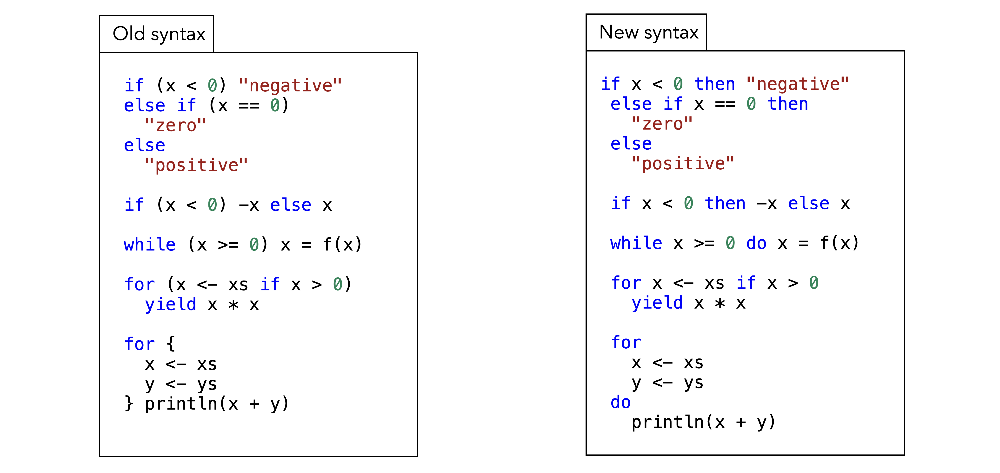
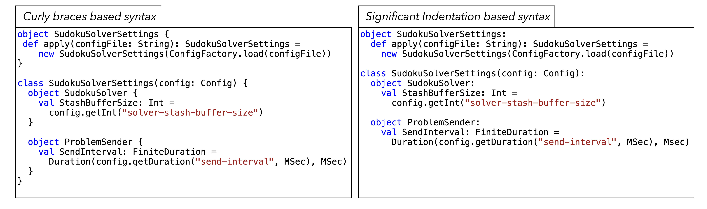

<!-- .slide: data-background-color="#781010" data-background-image="images/bg-reveal.ps.png" -->

[//]: # (The following is a hack to move the slide H2 section down)
## &#173;
## &#173;
## &#173;
## &#173;
## THE SCALA 3 COMPILER CODE REWRITE CAPABILITIES

---

## Content
## &#173;

* The Scala3 compiler's rewrite capabilities fall into three categories:
    * Rewrite some deprecated language syntax
    * Rewriting to alternative syntax using significant indentation
    * Rewriting to alternative control structures syntax
* For the last two, rewriting can also be in the opposite direction
#### &#173;
* Let's have a detailed look at each of them

---

## Rewriting of deprecated syntax - I
* Deprecations are tightly coupled to a version of the language
* In general, a language feature will be marked deprecated in some version of the language. 
    * A Scala release is versioned with a *MAJOR.MINOR.PATCH* version scheme
    * Source compatibility versus Binary compatibility
        * Source incompatibility may manifest itself at the *MAJOR* and *MINOR* version level
    * For *MINOR* versions, a particular feature may be removed or changed by passing through a deprecation stage

---

## Rewriting of deprecated syntax - II
* The Scala 3 compiler has a number of options that can automatically rewrite some deprecated language features
    * There's a strategy defining how language features will be phased in and out after the Scala 3.0 release
* Scala 3.0
    * Support of Scala 2.13 syntax which had some deprecations
    * Rewrite of these via the ***-rewrite -source:3.0-migration*** compile options
* Scala 3.x (x >= 1)
    * Support of Scala 3.0 syntax which introduced new deprecations
    * Rewrite of these via the ***-rewrite -source:future-migration*** compile options
* Use the [***Scala 3 Migrate sbt plugin***](https://github.com/scalacenter/scala3-migrate)
    * Learn how to use it by following the [***Scala 3 Migration Course***](https://github.com/scalacenter/scala3-migration-course)

---
<!-- .slide: data-background-color="#94aabb" data-background-image="images/bg-reveal.ps.png" -->

## Rewriting of deprecated code
## &#173;
* In this exercise, we will use Scala 3's code rewriting capabilities to automatically rewrite some deprecated code 
    * Make sure you're positioned at exercise *"dotty deprecated syntax rewriting"*
    * Follow the exercise instructions provided in the README.md file in the code folder

---

## New syntax in Scala 3
## &#173;

* Scala 3 introduces a number of syntax changes for Scala 2 language constructs such as
    * [***Contextual Abstractions***](https://dotty.epfl.ch/docs/reference/contextual/index.html) (implicits)
    * [***Extension methods***](https://dotty.epfl.ch/docs/reference/contextual/extension-methods.html)
    * ...
* Two other notable syntax changes
    * [***New Control Syntax***](https://dotty.epfl.ch/docs/reference/other-new-features/control-syntax.html) (opt-in)
    * [***Optional Braces syntax***](https://dotty.epfl.ch/docs/reference/other-new-features/indentation.html) - indentation is significant

---

## New Control Structure syntax in Scala 3
## &#173;

---

## Curly braces versus Significant Indentation
## &#173;
- Curly braces versus Significant Indentation

---

## New syntax in Scala 3
## &#173;

* ***scalac*** can rewrite code (both ways) to New Control Syntax and Optional Braces syntax
* Move one step at a time by using the following compiler options:
    * ***-rewrite -new-syntax***
    * ***-rewrite -old-syntax***
    * ***-rewrite -indent***
    * ***-rewrite -noindent***
## &#173;
* Let's give this a spin!

---
<!-- .slide: data-background-color="#94aabb" data-background-image="images/bg-reveal.ps.png" -->

## New Control Syntax and Optional Braces Syntax
## &#173;

* In this exercise, we will use Scala 3's code rewriting capabilities to automatically rewrite between different syntax options 
    * Make sure you're positioned at exercise *"dotty new syntax and indentation based syntax"*
    * Follow the exercise instructions provided in the README.md file in the code folder

