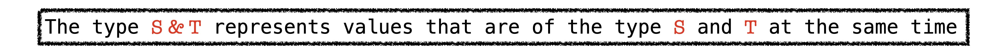
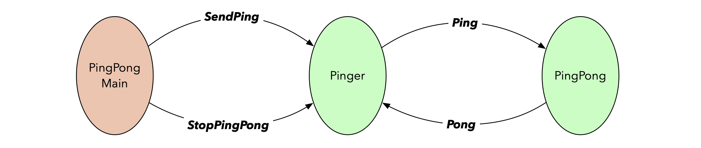
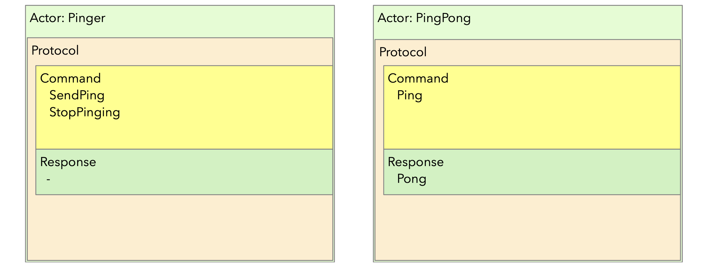
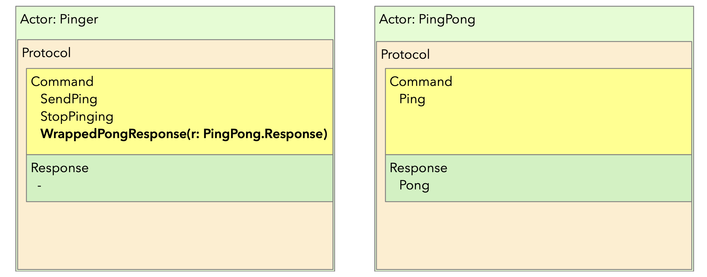
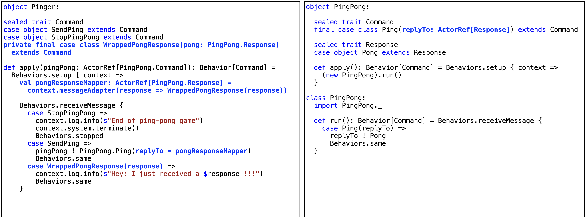
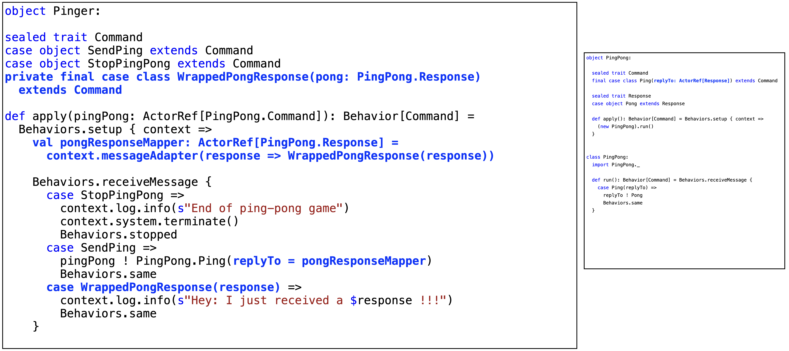

<!-- .slide: data-background-color="#781010" data-background-image="images/bg-reveal.ps.png" -->

[//]: # (The following is a hack to move the slide H2 section down)
## &#173;
## &#173;
## &#173;
## &#173;
## NEW TYPES IN SCALA 3
### Union and Intersection Types

---

## ***`Intersection`*** & ***`Union`*** Types
## &#173;

* Scala 3 introduces new types:
    * Intersection Types
    * Union Types
* Let's have a look at both

---

## ***`Intersection`*** Types
## &#173;

* An ***`Intersection`*** Type is created using the ***`&`*** operator on two types
* For example, using some types ***`S`*** and ***`T`***:

```scala
type S            // Some type S
type T            // Some type T
type ST = S & T   // Intersection Type ST which has all the members of both S & T
```

* From the docs:



* ***`&`*** is commutative: ***`A & B`*** is the same type as ***`B & A`***

---

## ***`Intersection`*** Types - Example
## &#173;

* A simple example:

```scala
trait Growable:
  def growBy(percent: Int): this.type =
    println(s"Growing by $percent%")
    this

trait Paintable:
  def paint(color: Int): this.type =
    println(s"Painted with color $color")
    this


def resizeAndPaint(obj: Growable & Paintable): Unit =
  obj.growBy(20).paint(0x10FF00).growBy(40).paint(0x0010FF)
 
```

* and using it:

```scala
scala> resizeAndPaint(new Growable with Paintable)
     Growing by 20%
     Painted with color 1113856
     Growing by 40%
     Painted with color 4351
```

---

## ***`Union`*** Types
## &#173;

* A ***`Union`*** Type is created using the ***`|`*** operator on two types
* For example, using some types ***`S`*** and ***`T`***:

```scala
type S            // Some type S
type T            // Some type T
type ST = S | T   // Union Type ST 
```
* From the docs:


* ***`|`*** is commutative: ***`A | B`*** is the same type as ***`B | A`***
* ***`Union`*** and ***`Intersection`*** Types are duals of each other
* The *least upper bound* (lub) of a set of types is the union of these types

---

## ***`Union`*** Types - Example I
## &#173;

* A simple example

```scala
enum Tools:
  case Hammer(size: Int)
  case Screwdriver(size: Int)

enum ToolSupplies:
  case Nail(size: Int)
  case Screw(size: Int)

def printIt(t: Tools | ToolSupplies): Unit = t match
  case tool: Tools          => println(s"Got a tool: $tool")
  case supply: ToolSupplies => println(s"Got a supply: $supply")
 
```

* and using it:

```scala
scala> import Tools._
       import ToolSupplies._

scala> printIt(Hammer(6))
Got a tool: Hammer(6)

scala> printIt(Nail(9))
Got a supply: Nail(9)
```
---

## ***`Union`*** Types - Example II
### Akka Typed Actors - encoding
## &#173;

* The behaviour of an Actor is implemented via the ***`akka.actor.typed.Behavior`*** API
#### &#173;
* The ***`Behavior`*** takes a type parameter which corresponds to the message types the ***`Behavior`*** can and will handle as formally defined in its ***`Command`*** protocol
#### &#173;
* On top of the commands an Actor can process, it will also have to process Responses from other Actors as defined in the latter's ***`Response`*** protocol
#### &#173;
* How do we encode a behaviour so that it can process both commands and responses internally, while limiting the external protocol to ***`Command`***?

---

## ***`Union`*** Types - Example II
### Akka Typed Actors - encoding
## &#173;

* Let's look at an example with two Actors: a PingPong Actor and a Pinger Actor:



---

## ***`Union`*** Types - Example II
### Akka Typed Actors - encoding

* The protocols for the Pinger and the PingPong Actors



* The problem to solve is how to extend the Pinger's behaviour so that it "understands" the Pong response

---

## ***`Union`*** Types - Example II
### Akka Typed Actors - encoding

* Akka Typed 2.6 uses a message adapter/response wrapper approach



* The ***`Pong`*** message is wrapped in a ***`WrappedPongResponse`*** message

---

## ***`Union`*** Types - Example II
### Akka Typed Actors - encoding



---

## ***`Union`*** Types - Example II
### Akka Typed Actors - encoding



---

## ***`Union`*** Types - Example II
### Akka Typed Actors - encoding

* Message adapters with Response wrappers solve the issue, but
    * this is quite convoluted and it adds a lot of boilerplate
    * requires an extra effort from anyone trying to understand the code
#### &#173;
* There is a better solution using Scala 3's ***`Union`*** Types!
#### &#173;
* Let's explore that

---

## ***`Union`*** Types - Example II
### Akka Typed Actors - encoding

* An example (applicable to Akka)

```scala
enum Command:
  case Reset
  case Run(times: Int)

enum Response:
  case RunFailed(reason: String)
  case RunFinished

trait Behavior[-A]:
  def treatMsg(message: A): Unit = println(s"Treating message: $message")

type CommandAndResponse = Command | Response

// implicitly[Behavior[CommandAndResponse] <:< Behavior[Command]]
val internalBehavior: Behavior[CommandAndResponse] = new Behavior[CommandAndResponse]{}
val externalBehavior: Behavior[Command] = internalBehavior   // Contravariance at work
 
```
```scala
internalBehavior.treatMsg(Command.Reset)
internalBehavior.treatMsg(Command.Run(5))
internalBehavior.treatMsg(Response.RunFailed("Too much to do"))
internalBehavior.treatMsg(Response.RunFinished)
  
externalBehavior.treatMsg(Command.Reset)
externalBehavior.treatMsg(Command.Run(110))
externalBehavior.treatMsg(Response.RunFailed("Too much to do"))   // Doesn't compile
 
```

---

## Summary
### &#173;

* In this chapter, we have taken a closer look at two new Types in Scala 3:
    * ***`Union`*** Types
    * ***`Intersection`*** Types
### &#173;
* ***`Union`*** Types define a type that is a *Least Upper Bound* on two [possibly unrelated] types
### &#173;
* ***`Intersection`*** Types define a type that is a *Highest Lower Bound* on two types

---
<!-- .slide: data-background-color="#94aabb" data-background-image="images/bg-reveal.ps.png" -->

## Using ***`Union Types`***
## &#173;

* In this exercise, we will utilise ***`Union Types`*** to vastly simplify the handling of responses to messages sent by an Akka actor
    * Make sure you're positioned at exercise *"union types"*
    * Follow the exercise instructions provided in the README.md file in the code folder
