<!-- .slide: data-background-color="#781010" data-background-image="images/bg-reveal.ps.png" -->

[//]: # (The following is a hack to move the slide H2 section down)
## &#173;
## &#173;
## &#173;
## Scala 3 migration course

---

## Course overview
## &#173;

* In this course we will:
    * Start from an existing sbt build (Scala 2.13)
    * Use sbt-scala3-migrate to migrate the build to Scala 3
### &#173;
* The objective is to learn the four steps of migrating a project:
    * Updating the dependencies
    * Updating the compiler options
    * Patching the syntax of the code
    * Fixing the type inference errors


---

## Dotty/Scala 3
## &#173;

* Dotty: New research project started in 2012 by Martin Odersky's lab at EPFL
* Dotty announced to become Scala 3 (April 2018)
* 3.0.0 released on May 13, 2021
* [3.3.0](https://github.com/lampepfl/dotty/releases/tag/3.3.0) relased on May 30th, 2023. First LTS (Long Term Support) release.
* IDE support
    * [Visual Studio Code](https://code.visualstudio.com) with [Metals](https://scalameta.org/metals/)
        * integrated support in Metals including Scala Worksheet support!
    * [IntelliJ](https://www.jetbrains.com/idea/)
        * Scala 3 support with the [Scala Plugin](https://lp.jetbrains.com/intellij-scala/)
* There's the [Scala 3 Migration Guide](https://docs.scala-lang.org/scala3/guides/migration/compatibility-intro.html)!

---
## Compatibility in Scala 2
## &#173;

- Before Scala 2.10: no compatibility between any two versions
  - Different standard library
  - Different binary interface
- Since Scala 2.10: strict binary compatibility in minor versions
  - 2.13.11 is compatible with 2.13.8
  - 2.13.11 is not compatible with 2.12.19
  
## &#173;
### => Ecosystem jump between 2.12 and 2.13

---

## Compatibility between Scala 2.13 and Scala 3
## &#173;

* Scala 3 uses the Scala 2.13 standard library
* Scala 3 produces Scala 2.13 compatible binaries (class files, sjsir, ...)
* Scala 3 can read Scala 2.13 signatures (Pickle format)
* Scala 2.13 can read Scala 3 signatures (TASTy) using -Ytasty-reader

## &#173;

### => Backward and forward compatibility between Scala 2.13 and Scala 3

---

## For 3 use 2.13
## &#173;

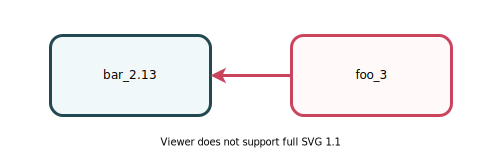

```
lazy val foo = project.in(file("foo"))
  .settings(
    scalaVersion := "3.0.0",
    libraryDependencies +=
      ("org.bar" %% "bar" % "1.0.0").cross(CrossVersion.for3Use2_13)
  )
```

---

## For 2.13 use 3 (TASTy reader)
## &#173;

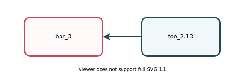

```
lazy val foo = project.in(ile("foo"))
  .settings(
    scalaVersion := "2.13.6",
    scalacOptions += "-Ytasty-reader",
    libraryDependencies += 
      ("org.bar" %% "bar" % "1.0.0").cross(CrossVersion.for2_13Use3)
  )
```

---

## The sandwich pattern
## &#173;

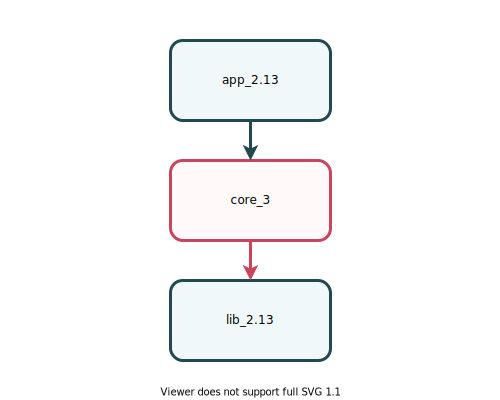

---

## The diamond pattern
## &#173;

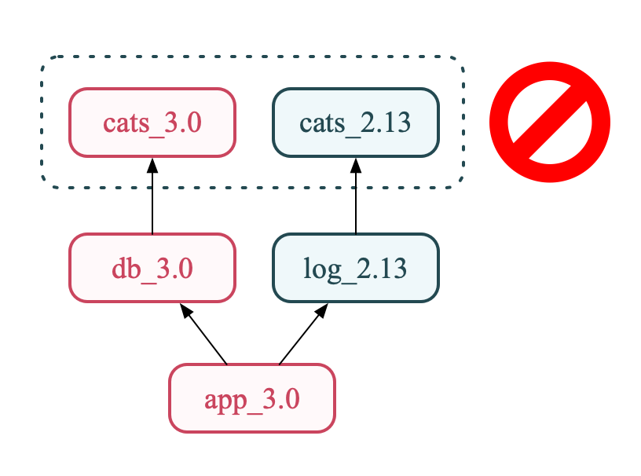

```
[error] Modules were resolved with conflicting cross-version suffixes in main:
[error]    org.typelevel:cats _3, _2.13
```

---

## Metaprogramming
## &#173;

- Scala 2.13 macros are experimental
- Scala 3 macros are based on new foundations.
They are simpler and more stable.
- Scala 2.13 and Scala 3 macros are incompatible
- The community started migrating the macro libraries to Scala 3.
See [Table of macro libraries.](https://scalacenter.github.io/scala-3-migration-guide/docs/macros/macro-libraries.html)

---

## Compiler plugins
## &#173;

- The Scala 3 compiler is completely new
- Scala 2.13 plugins cannot be used in Scala 3
- Scala 3 plugins are more constrained
- Some important plugins were integrated in the compiler, and can be activated with an option:
  - `-Ykind-projector`
  - `-scalajs`
  - `-semanticdb`

---
## Compiler Options (`scalacOptions`)
## &#173;

- Most options are available
- Some are renamed
- Some are dropped
- Some of the most used Scala 2 options are ported to Scala 3. For example, we ported `-Wunused` to Scala 3.3.0.
- See [table of compiler options](https://docs.scala-lang.org/scala3/guides/migration/options-lookup.html).

---
## Syntactic changes

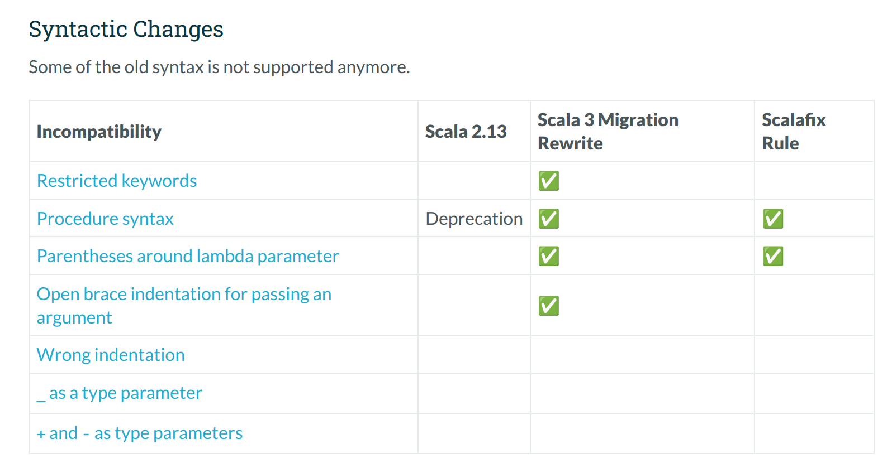

---

## Dropped features

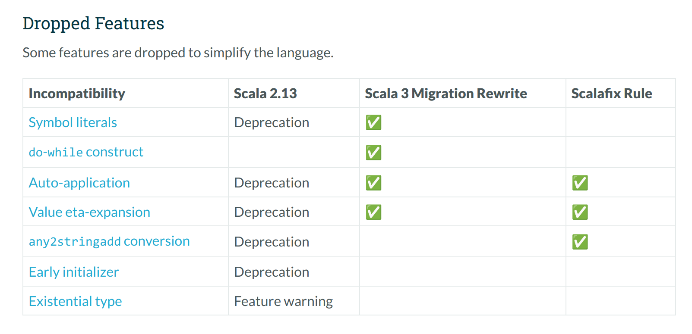
---

## Contextual abstractions (Implicits)

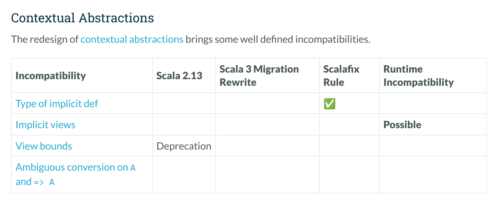

---

## Other changed features

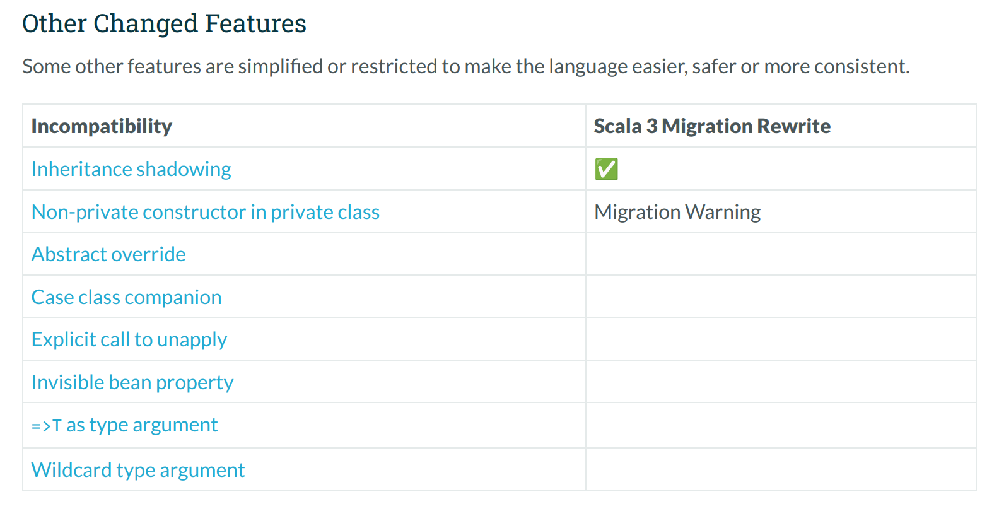

---

## Type checker and type inference

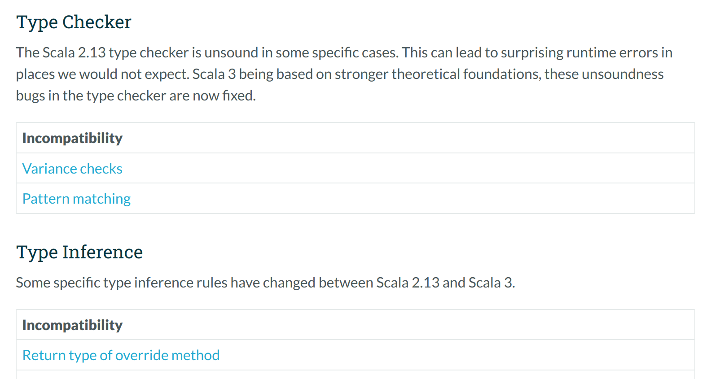

---

## sbt-scala3-migrate

- It's an sbt plugin

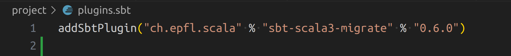

- It can assist you during the migration to Scala 3 of your build

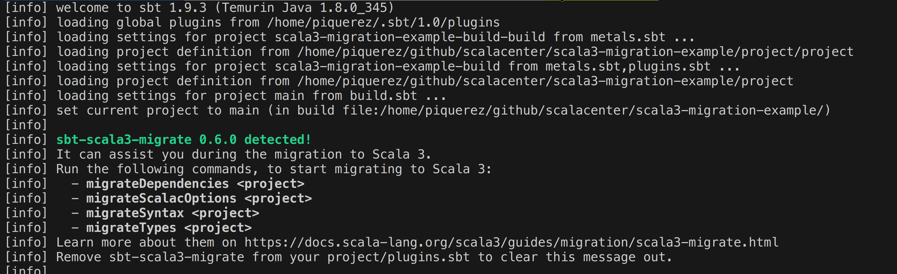

---

## Scala 3 migration course


---

## Scala 3 migration course
## &#173;

```
$ cmtc install -f -s scalacenter/scala3-migration-course
Downloading studentified course from 'https://github.com/scalacenter/scala3-migration-course/releases/download/0.1.0/scala3-migrate-course-student.zip' to courses directory

Project scalacenter/scala3-migration-course (0.1.0) successfully installed to:
  /home/user/Library/Caches/com.lunatech.cmt/Courses/scala3-migration-course

Current course set to '/home/user/Library/Caches/com.lunatech.cmt/Courses/scala3-migration-course'

Exercises in repository:
  1.  *   exercise_000_initial_state
  2.      exercise_001_install_sbt_scala3_migrate
  3.      exercise_002_migrate_dependencies
  4.      exercise_003_migrate_scalac_options
  5.      exercise_004_migrate_syntax
  6.      exercise_005_migrate_types
  7.      exercise_006_update_scala_version
```
